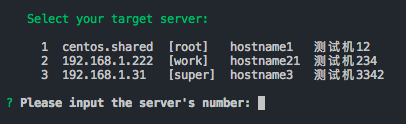

JumpServer
---
跳板机



### Requirements
* Nodejs 8.x+  
* Npm 6.x+  

### Install
如果本地已有node环境可以直接安装
```sh
npm i @gavinning/jump-server -g
```

如果本地尚未安装node环境，但是已经启用``oh-my-zsh``，可以使用此命令一键安装
```sh
curl -L https://git.io/n-install | bash && source ~/.zshrc && npm i @gavinning/jump-server -g && j2 -v
```

如果本地尚未安装node环境，也没有``oh-my-zsh``，可以根据本地shell修改配置进行安装，也可以分步安装例如：
```sh
# step 1
curl -L https://git.io/n-install | bash

# step 2
# 刷新本地环境变量，新开终端窗口
# 或者执行刷新命令类似 source ~/.zshrc 或者 source ~/.bash_profile

# step 3
npm i @gavinning/jump-server -g && j2 -v
```

### Usage
```sh
j2
# or
jumpserver
# or
j2 -v
# or
j2 -h
```

### yaml配置文件
简单明了的配置文件，默认路径``~/.jumpserver.yml``  
``vim ~/.jumpserver.yml`` 编辑配置文件
```yaml
# 统一授权
auth:
    port: 22
    password: 123
    # 默认privateKey优先
    privateKey: '/root/.ssh/your-private-key'
    passphrase: 123
    # 连接超时时间
    readyTimeout: 5000

server:
    centos.shared:
        name: hostname1
        desc: 测试机12
        username: root
        
    192.168.1.222:
        name: hostname21
        desc: 测试机234
        username: work

    192.168.1.31:
        name: hostname3
        desc: 测试机3342
        port: 22
        username: super
        password: 123
        privateKey: '/root/.ssh/your-private-key'
        passphrase: 123
```